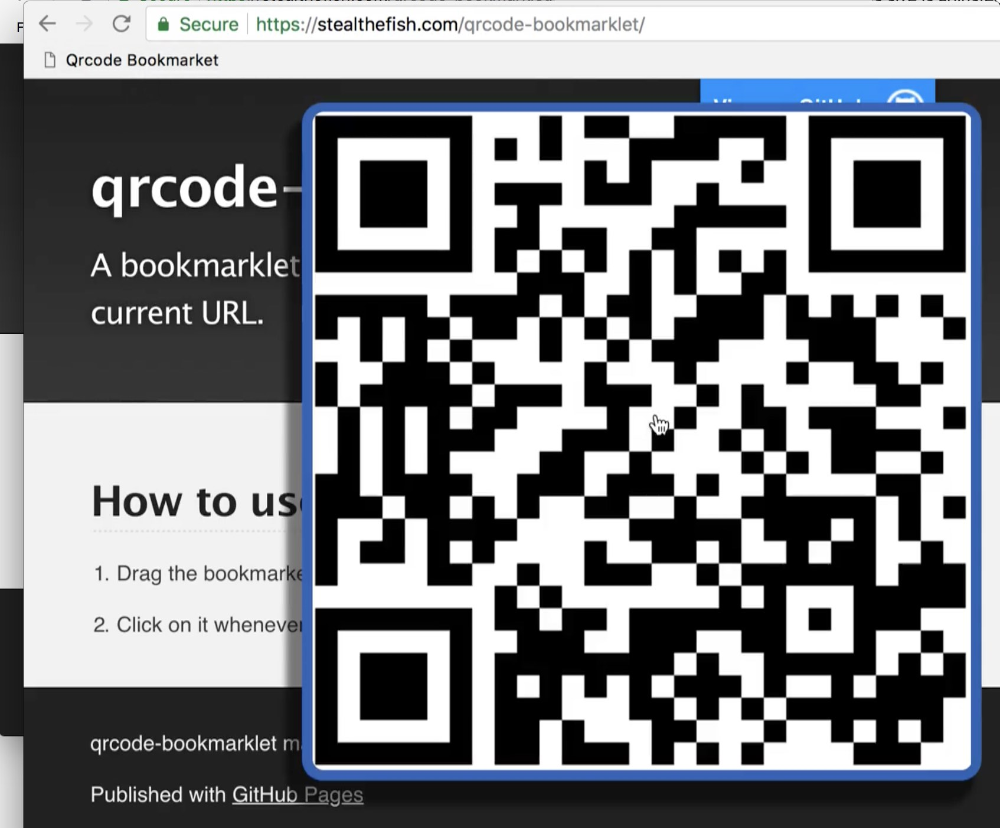

# qrcode-bookmarklet

Generate a qrcode of the current page's url.

Useful to open quickly a website in your mobile device.

- `qrcode-bookmarklet-src.js`: the script used in the bookmarklet
- `generate.js`: handy tool to transform the source code into a bookmarklet

**Check out the [demo](https://stealthefish.com/qrcode-bookmarklet/)**

